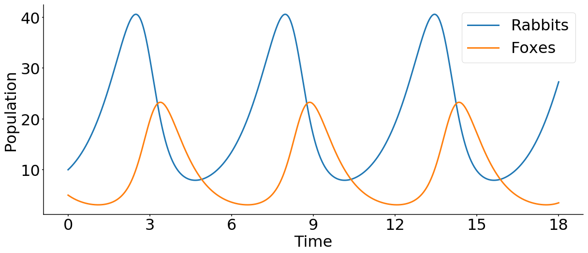

# Examples for Numerical Differential Equation Solving
Use numerical methods to solve ordinary differential equations.
## Lotka-Volterra model

The model can be described by  

du/dt = au - bu*v 
dv/dt = -cv + dbu*v 
 
with the following notations:
- u: number of preys (for example, rabbits)
- v: number of predators (for example, foxes)
- a, b, c, d are constant parameters defining the behavior of the population:
    - a: the natural growing rate of rabbits, when there's no fox
    - b: the natural dying rate of rabbits, due to predation
    - c: the natural dying rate of fox, when there's no rabbit
    - d: the factor describing how many caught rabbits let create a new fox

## ODE solver
- Python
    - [scipy.integrate.odeint](https://docs.scipy.org/doc/scipy/reference/generated/scipy.integrate.odeint.html)
    - [scipy.integrate.ode](https://docs.scipy.org/doc/scipy/reference/generated/scipy.integrate.ode.html)

- Julia
    - [Sundials.jl](https://github.com/JuliaDiffEq/Sundials.jl)
    - [ODE.jl](https://github.com/JuliaDiffEq/ODE.jl)
    - [SciPyDiffEq.jl](https://github.com/JuliaDiffEq/SciPyDiffEq.jl)

- R
    - [deSolve](https://cran.r-project.org/web/packages/deSolve/index.html)
    - [diffeqr](https://github.com/JuliaDiffEq/diffeqr)
    
- MATLAB
    - [ode45](https://jp.mathworks.com/help/matlab/ref/ode45.html?lang=en)

## License
[MIT](/LICENSE)